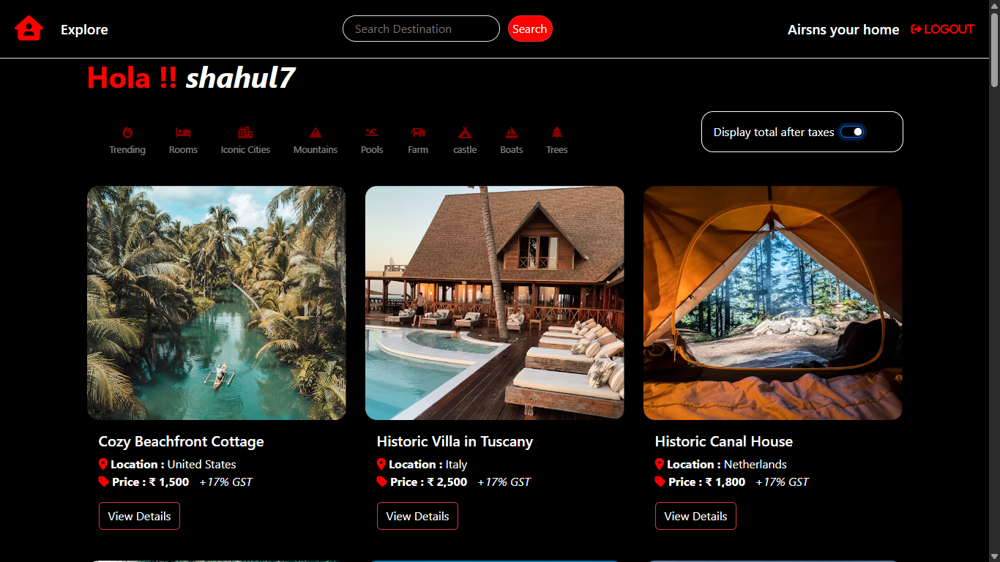
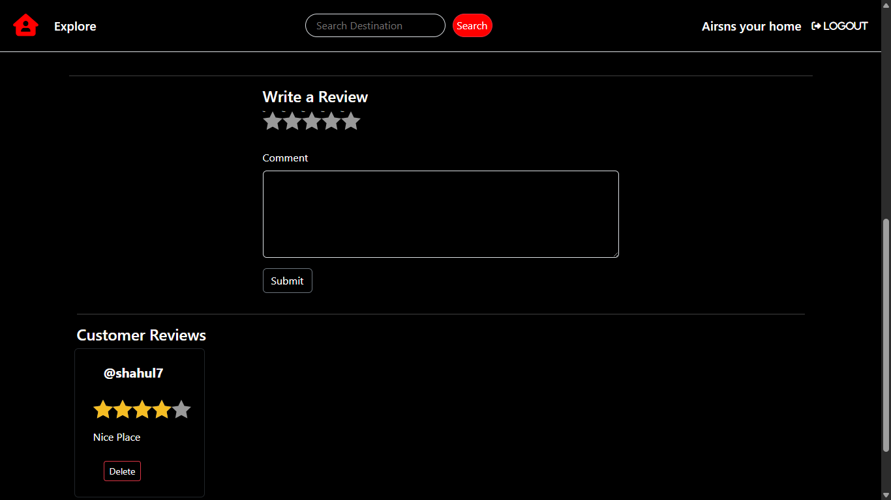

# Airsns

A full-stack Airbnb clone built with the MERN stack (MongoDB, Express.js, React.js, Node.js). This project features seamless integration of front-end and back-end components to deliver a scalable web application that mimics Airbnb’s core functionalities.  
Live at: https://airsns-project.onrender.com/

---

## Table of Contents

- [Features](#features)  
- [Tech Stack](#tech-stack)  
- [Architecture / Directory Structure](#architecture--directory-structure)  
- [Installation & Setup](#installation--setup)  
- [Preview](#Preview)  
 

---

## Features

Here are some of the key features implemented:

- User authentication and authorization  
- Listing creation, editing, deletion  
- Booking / reservation flow  
- Image uploads (for property photos)  
- Search, filtering, and browsing of listings  
- Host / guest UI separation  
- Responsive front-end  
- Integration between client and server  
- Error handling, validation, middleware utilities  

---

## Tech Stack

**Backend:**

- Node.js  
- Express.js  
- MongoDB  
- Mongoose (ODM)  
- Middleware, error handling, etc  

**Frontend:**

- React.js  
- (Possibly EJS / templating, depending on views)  
- CSS / styling (you may note Tailwind, or custom CSS) :contentReference[oaicite:1]{index=1}  

---

## Architecture / Directory Structure

Here’s an approximate view of the project structure (from the repo):  

**Key components:**

- `controller/` — request handlers and business logic  
- `models/` — Mongoose schemas & models  
- `routes/` — defines API endpoints / routes  
- `utils/` — helper functions, utilities  
- `views/` — (if server-side rendering or templates)  
- `public/` — static assets  
- `middleware.js` — custom middleware (e.g. auth, error catching)  
- `cloudConfig.js` — cloud / external service configuration (e.g. file uploads)  
- `MyErr.js` — custom error class  
- `schema.js` — input validation / schema definitions  

---

## Installation & Setup

1. **Clone the repository**

   ```bash
   git clone https://github.com/ShahShelby7/Airsns.git
   cd Airsns
   npm install
   PORT= (e.g. 5000)
    MONGODB_URI=your_mongodb_connection_string
    JWT_SECRET=some_secure_secret
    CLOUDINARY_CLOUD_NAME=…
    CLOUDINARY_API_KEY=…
    CLOUDINARY_API_SECRET=…
2. **To run Locally**
   ```bash
    node index.js

## 🖥️ App Previews

### 🏠 Homepage
<p align="center">
  
</p>

### 📋 Dynamic Searching
<p align="center">
  
</p>

### 🧳 Property Details
<p align="center">
  
</p>

### 🧳 Add Property
<p align="center">
  
</p>

### 🧳 Review
<p align="center">
  
</p>


